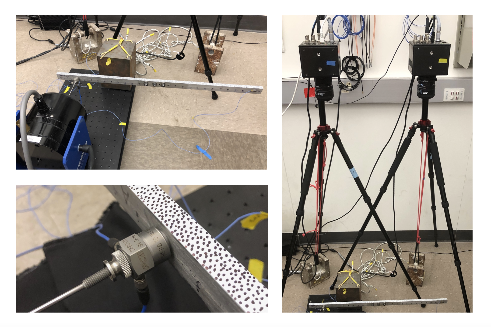

# BRBtesting

This repository contains and shows data from experimental testing on a Brake-Reuss beam, using MATLAB files. The data features measurements from hammer impacts, resonance decay and forced frequency responses. All these tests have been recorded with accelerometers, and DIC data from high speed camera measurements is present for the resonance decay test. Experiments were performed in the Tribomechadynamics Lab of Rice University (Houston, TX, USA), Department of Mechanical Engineering, http://brake.rice.edu.

Additional information on the structure, the measurements and their analysis be found in the script showData.mlx and in the articles: 
 
W. Chen, D. Jana, A. Singh, M. Jin, M. Cenedese, G. Kosova, M. W. R. Brake, C. W. Schwingshackl, S. Nagarajaiah, K. Moore, and J. P. Noël. Measurement and identification of the nonlinear dynamics of a jointed structure using full-field data; Part I - Measurement of nonlinear dynamics. Mechanical Systems and Signal Processing, 166:108401, 2022. https://doi.org/10.1016/j.ymssp.2021.108401

M. Jin, G. Kosova, M. Cenedese, W. Chen, D. Jana, A. Singh, M. W. R. Brake, C. W. Schwingshackl, S. Nagarajaiah, K. Moore, and J. P. Noël. Measurement and identification of the nonlinear dynamics of a jointed structure using full-field data; Part II - Nonlinear system identification. Mechanical Systems and Signal Processing, 166:108402, 2022. https://doi.org/10.1016/j.ymssp.2021.108402

Please consider citing these references when using the dataset.
